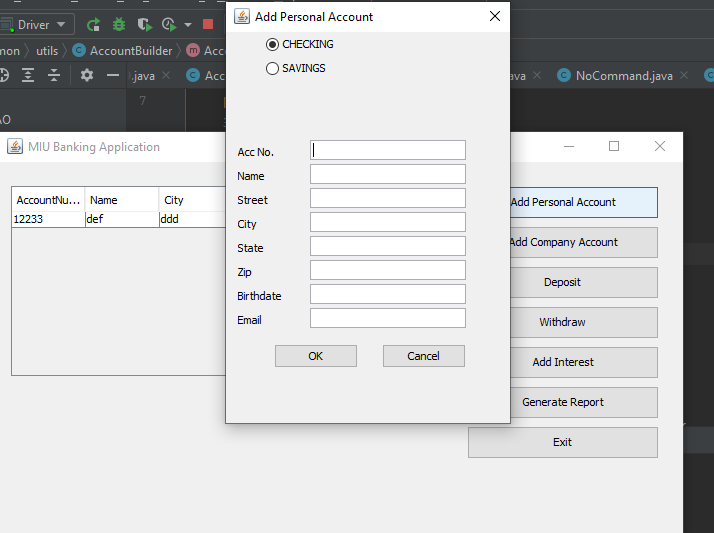

# Framework development
The project consisted a framework that will provide common operations for a banking system 
and a credit card application.
## Project screenshot

##  Built with

- Java
- Maven

##  Our Project

Our project can be found at https://github.com/daviidy/ASD_PROJECT

## To run the project in local

- make sure you have Maven and JDK 16+ installed in your computer
- clone the repository from here [repo link](https://github.com/daviidy/ASD_PROJECT)
- navigate in your terminal to the folder `ASD_PROJECT`
- open the project with IntelliJ or Eclipse or SpringToolSuite
- right-click on the pom.xml file located in the root of the project
- then click on Maven > Update the project

## Specifications

### Design the class diagram to a banking system with the following Use cases:
- Create a personal account 
- Create a Company account (checking or savings)
- Deposit money 
- Withdraw money 
- Add interest 
- Generate a report of accounts

### Design the class diagram for a Credit-Card processing system with the following use cases:
- Create a credit card account 
- Deposit money 
- Charge the account 
- Add interest 
- Generate monthly billing report

### Design a Framework for both of these applications.
The framework should abstract out all of the common operations between these two applications, and
others that would be similar in nature. The evaluation criteria for the project will be how well you have
captured common parts of the intended application domain(s) in the framework, and it's internal design via
patterns.

## Design patterns used

### Command Pattern

The IUIInvoker is the invoker (in contains all the buttons listeners such that, when the user clicks on a button,
it calls the execute method of the Command interface).
We have concrete commands that implements the Command interface (like the one for adding a personal account).
They also have a reference of the receiver (the concrete services).

### Observer Pattern

The AccountService is the subject that will notify the observers (IUIInvoker, UIStrategy, EmailSender).
It has the list of observers and use the notifyObservers() in the Subject Interface, to notify all the observers

### Strategy Pattern

We use the strategy pattern to encapsulate the family of behaviors for the views and the add interest algorithm.

##   Creators

 **Author**

- Github: [@daviidy](https://github.com/daviidy)
- Twitter: [@davidyao3](https://twitter.com/DavidYao3)
- LinkedIn: [@daviidy](https://www.linkedin.com/in/david-yao-6bb95299/)
- Personal Website: [@daviidy](http://david-yao.com)

##  Contributing

Contributions, issues and feature requests are welcome!

## Show your support

Give a ️ if you like this project!

##  License

This project is no licensed.
